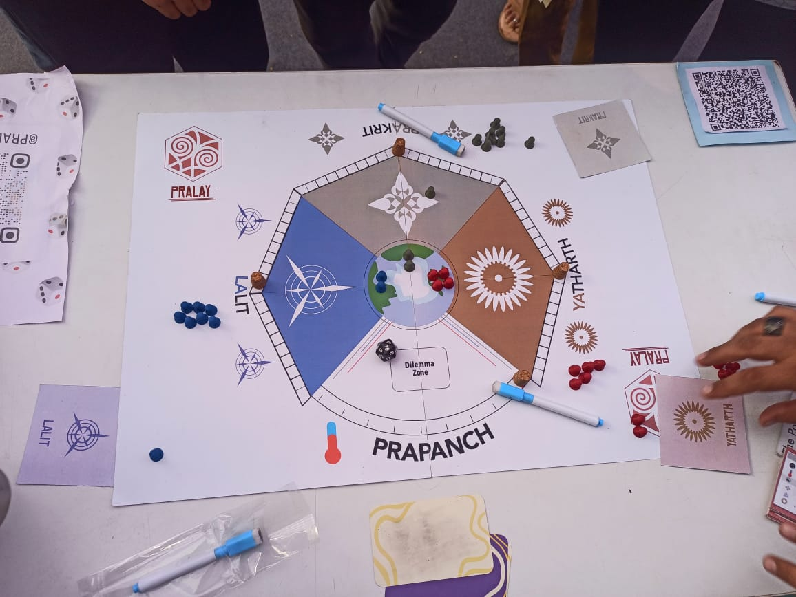
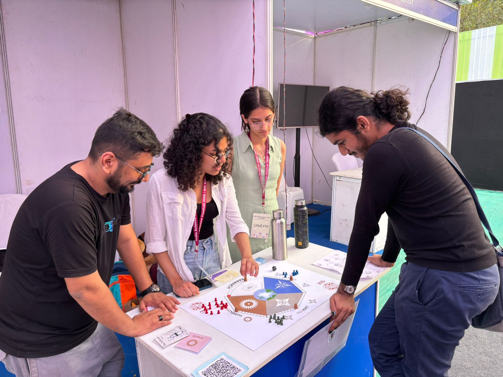

At the Young India Fellowship, me and three other Fellows developed a board game called Pralay.

Imagine a world facing the consequences of climate change. Let us assume that in India, extreme heat waves are causing outdoor workers to collapse. The government could advocate for a policy to ban work during peak hours. However, this would lead to significant financial losses and project delays. Now, picture yourself as an electoral candidate in a decision-making position. What would your strategy focus on: the wellbeing of workers or the economic welfare of your state?  

We developed a climate-based, strategy 3-6 player board game called Pralay, where players navigate climate scenarios like the one described above and take decisions as part of a presidential race to secure the votes of global citizens. As developers, we aim to engage players with the nuanced science and politics of climate change.

Stay tuned for more updates on [pralaythegame.com](https://pralaythegame.com).

