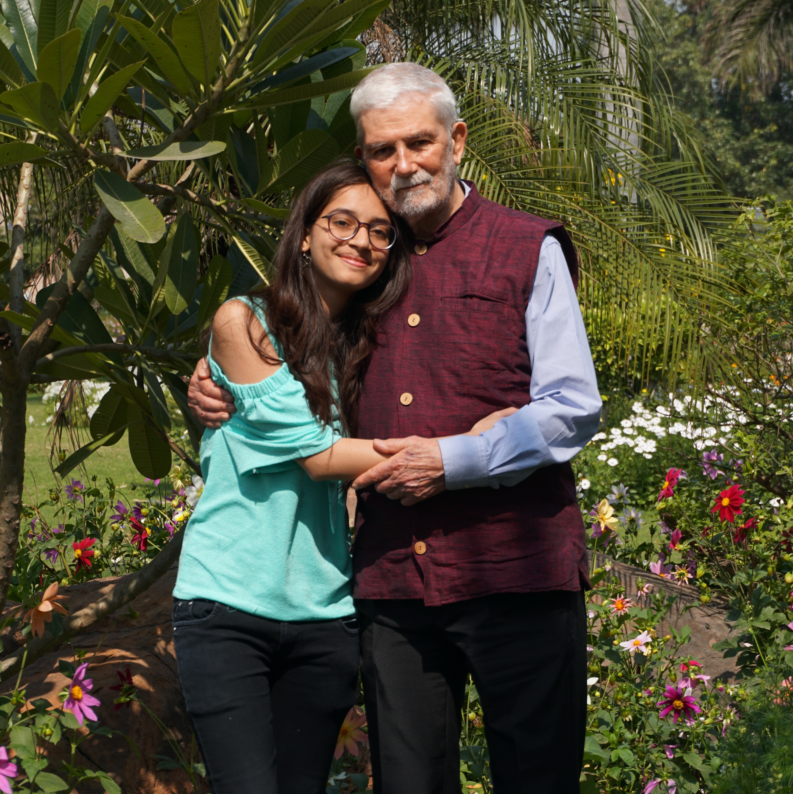

What started as a 3-month internship has turned into an almost 5-year commitment with [#semanticClimate](https://semanticclimate.github.io/p/en/).Over the years, I have grown from being an outreach intern, a programme manager to a developer. I have also had the pleasure of hosting and being part of various events, including the UN Datathon (at the United Nations, Geneva) and Climate Knowledge Hunt Hackathons (which I conceptualised). I also got the chance of leading development of a Python tool called [`docanalysis`](https://github.com/petermr/docanalysis); through which I learnt the philosophies and best practices of open source, which I practice till date.

I am extremely grateful to Peter Murray-Rust for being the best mentor :)

_Shweata and Peter_

## Presentations
Selected presentations and tutorials made as part of #semanticClimate.

## docanalysis tutotrial
A text-data mining tools, which scrapes the scientific literature and extraction structured information, in supervsied and unsupervised fashion.

<iframe width=100% height="315" src="https://www.youtube.com/embed/chX-9kM_LZs?si=pqKzpFG7jdYklU0T" title="YouTube video player" frameborder="0" allow="accelerometer; autoplay; clipboard-write; encrypted-media; gyroscope; picture-in-picture; web-share" referrerpolicy="strict-origin-when-cross-origin" allowfullscreen></iframe>

### [2024-10] The Tech We Want Presentation
<iframe width=100% height="315" src="https://www.youtube.com/embed/o50Jd1w6xKw?si=G8PYwiJprdRoz9lS&amp;start=16827" title="YouTube video player" frameborder="0" allow="accelerometer; autoplay; clipboard-write; encrypted-media; gyroscope; picture-in-picture; web-share" referrerpolicy="strict-origin-when-cross-origin" allowfullscreen></iframe>

### [2023-08] Wikimania, _Building a Climate Knowledge Explorer Using Wikimania Tools_

<iframe width=100% height="315" src="https://www.youtube.com/embed/8XZ4-yp0f-c?si=1XLbEpRJdVzdnbYE" title="YouTube video player" frameborder="0" allow="accelerometer; autoplay; clipboard-write; encrypted-media; gyroscope; picture-in-picture; web-share" referrerpolicy="strict-origin-when-cross-origin" allowfullscreen></iframe>